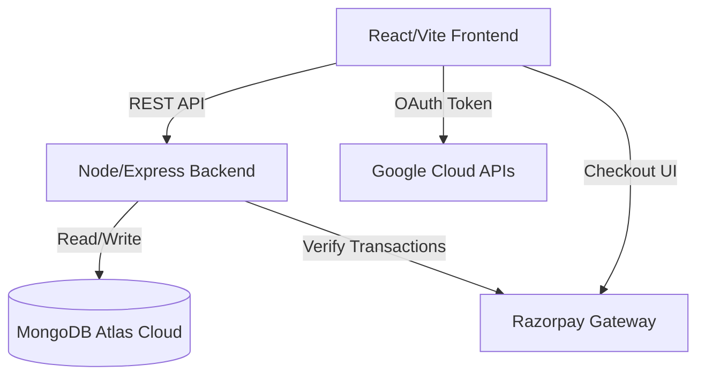

<div align="center">
  <br />
  <h1>🛍️ Menzu - Premium E-Commerce Platform</h1>
  <p>
    <strong>A high-performance, full-stack MERN application built for seamless digital retail.</strong>
  </p>
  <p>
    <a href="https://menzu-olive.vercel.app"><strong>View Live Demo »</strong></a>
  </p>
  
  <p align="center">
    
    
    
    
    
  </p>
</div>

<br />

## 📖 About The Project

Menzu is a fully functional, production-ready E-commerce web application. Designed from the ground up to provide a premium, frictionless shopping experience, the platform handles everything from product discovery and authenticated user sessions to live payment processing and real-time shipment tracking.

The project demonstrates advanced architectural patterns including a headless backend API, secure state management, and serverless cloud deployments.

### ✨ Key Technical Features

* **State Management:** Custom React Context API (`GlobalState`) handling optimistic UI updates and backend synchronization without prop-drilling.
* **Authentication:** Integration with **Google OAuth 2.0** for secure, password-less user onboarding.
* **Payment Gateway:** Bulletproof sandbox integration with the **Razorpay API**, handling real-currency (INR) dynamic checkout sessions.
* **Complex Data Modeling:** Relational NoSQL data mapping utilizing **Mongoose** (linking Users ↔ Orders ↔ Products ↔ Carts).
* **Dynamic Routing:** Protected routes and seamless client-side Single Page Application (SPA) navigation via React Router.
* **Bespoke UI Design:** A custom "Glassmorphism" design system backed by Tailwind CSS, featuring dark-mode native aesthetics and micro-animations.

---

## 🏗 Architecture Overview



**Hosting Infrastructure:**
* **Frontend:** Deployed on Vercel's Edge CDN.
* **Backend:** Hosted independently on Render.com.
* **Database:** MongoDB Atlas distributed cluster.

---

## 🛠 Engineering Decisions & Challenges

**1. Cart Synchronization (Optimistic UI)**
* **The Challenge:** To make the shopping cart feel lightning fast, relying solely on backend API round-trips for UI updates was too slow.
* **The Solution:** Implemented an optimistic UI model within the Context API. When a user clicks "Add to Cart", the UI updates immediately in browser memory, while an asynchronous task safely persists the exact ledger to the Express backend.

**2. Dynamic Order Tracking**
* **The Challenge:** Hard-coded shipping states don't provide value; users need to know exactly where their purchase is securely.
* **The Solution:** Engineered an advanced data pipeline where the React UI evaluates the specific status string of native MongoDB Order records (`Ordered`, `Shipped`, `Out for Delivery`, `Delivered`) to dynamically render a proportional tracking UI timeline logic. 

**3. Repository Monorepo Structure**
* Designed as a full decoupled monorepo. Both the `frontend` and `backend` directories live together for seamless development context but deploy completely unaware of each other to external cloud architecture.

---

## 🚀 Running Locally

Want to inspect the code and run it on your own machine?

### Prerequisites
- Node.js (v18+)
- Local MongoDB instance or Atlas URI

1. **Clone the repo**
   ```bash
   git clone https://github.com/PremSahith/Menzu.git
   cd Menzu
   ```

2. **Backend Setup**
   ```bash
   cd backend
   npm install
   ```
   Create a `backend/.env` file with your config: `MONGO_URI`, `PORT=5001`, `RAZORPAY` keys, and `GOOGLE_CLIENT_ID`.
   ```bash
   node server.js
   ```

3. **Frontend Setup**
   ```bash
   cd ../frontend
   npm install
   ```
   Create a `frontend/.env` file: `VITE_API_URL=http://localhost:5001`, `VITE_RAZORPAY_KEY`, `VITE_GOOGLE_CLIENT_ID`.
   ```bash
   npm run dev
   ```

---
*Built by [PremSahith](https://github.com/PremSahith). Feel free to reach out if you have any questions about the MERN stack or platform engineering!*
